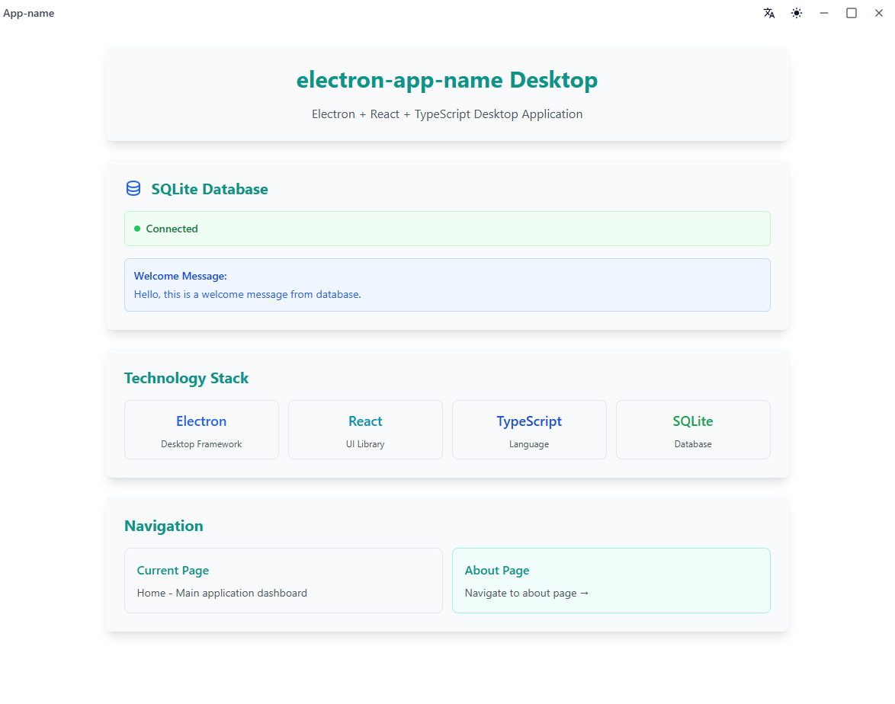
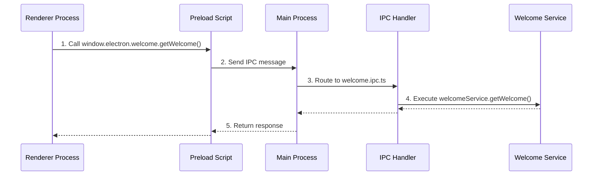

<h1 align="center"> Electron App Template</h1>

💅 **A modern Electron app boilerplate with React v19, TypeScript v5, TailwindCSS v3, Ant Design v5, SQLite3 database, and automated GitHub releases.**

<p align="center">
  <a href="https://www.npmjs.com/package/@wuchuheng/electron"></a>
  <a href="https://github.com/wuchuheng/electron-app-template/actions/workflows/release.yml"></a>
  <a href="https://github.com/wuchuheng/electron-app-template/actions/workflows/test.yml"></a>
  <a href="https://github.com/wuchuheng/electron-app-template"></a>
</p>

<p align="center">
  
</p>

## ✨ Features

### 🚀 Core Features

🔥 **Fast and Ready-to-go** with a well-thought-out structure  
🚀 **Hot reload** for main process and **Fast Refresh** for renderer  
🎉 **React Router DOM** for seamless navigation  
😎 **Preload (context bridge)** already configured  
🔮 **Automated GitHub releases** for **Windows**, **Mac** and **Linux**  
🗄️ **SQLite3 database** with **TypeORM** integration  
🌍 **Internationalization (i18n)** with **react-i18next**  
🎨 **Modern UI** with **Ant Design** components

### 🛠️ Technologies

🔋 **Electron** v36.3.2  
⚛️ **React** v19.1.0  
🌎 **React Router DOM** v7.6.1  
💙 **TypeScript** v5.8.3  
📦 **Electron Forge** v7.8.1  
✨ **TailwindCSS** v3.4.17  
🎨 **Ant Design** v5.25.4  
🗄️ **better-sqlite3** v11.10.0 + **TypeORM** v0.3.24  
🌍 **i18next** v25.2.1 + **react-i18next** v15.5.2  
💫 **ESLint** + **Prettier** with **TailwindCSS** plugin  
🔮 **GitHub Actions** for automated releases

## 🏗️ Project Architecture

This project follows a well-structured layered architecture pattern:

## 🔌 Inter-Process Communication (IPC)

This template provides a type-safe, structured approach for Renderer-Main process communication. Here's how it works:

### 🚀 Step-by-Step Guide

Here's the IPC communication flow visualized with UML:



1. **Declare interfaces** in `src/types/electron.d.ts`:

```ts
declare global {
  interface Window {
    electron: {
      welcome: {
        getWelcome: () => Promise<Welcome>;
      };
    };
  }
}
```

2. **Configure IPC channels** in `src/shared/config.ts`:

```ts
export const config = {
  welcome: {
    getWelcome: createIpcChannel<void, Welcome>('welcome/getWelcome'),
  },
};
```

3. **Implement handler** in `src/main/ipc/`:

```ts
// welcome.ipc.ts
config.welcome.getWelcome.handle(async () => {
  return welcomeService.getWelcome();
});
```

4. **Call from Renderer**:

```ts
const welcome = await window.electron.welcome.getWelcome();
```

### 🌟 Key Benefits

- **Type Safety**: Full TypeScript support end-to-end
- **Separation of Concerns**: Handlers stay in main process
- **Discoverability**: All IPC endpoints in shared config
- **Testability**: Handlers are pure functions

### 🛠️ Best Practices

- Group related methods under namespaces
- Keep handlers thin - delegate to services
- Use JSDoc for complex parameter types
- Add error handling in services

```
Windows Layer → IPC Layer → IPC Layout → Service Layout → Repository Layout
```

### 📁 **Project Structure**

```bash
src/
├── main/
│   ├── database/          # Database configuration and entities
│   ├── ipc/              # Inter-Process Communication handlers
│   ├── main.ts           # Main process entry point
│   ├── services/         # Business logic and service layer
│   ├── utils/            # Utility functions and helpers
│   └── windows/          # Window management and creation
├── preload/
│   └── preload.ts        # Preload scripts for secure context bridge
├── renderer/
│   ├── App.tsx           # Main React application component
│   ├── assets/           # Static assets (images, icons, etc.)
│   ├── config/           # Frontend configuration
│   ├── i18n/             # Internationalization files
│   ├── layout/           # UI layout components
│   ├── pages/            # Application pages/screens
│   ├── renderer.css      # Global styles
│   ├── renderer.html     # HTML template
│   ├── renderer.ts       # Renderer process entry point
│   └── styles/           # CSS/SCSS style files
├── shared/
│   ├── config-utils.ts   # Shared configuration utilities
│   ├── config.ts         # Application configuration
│   ├── ipc-channel.ts    # IPC channel definitions
│   └── ipc-subscription.ts # IPC event subscriptions
└── types/
    ├── custom.d.ts       # Custom type definitions
    └── electron.d.ts     # Electron-specific types
```

### 🔄 **Architecture Flow**

1. **🪟 Windows Layer**: Manages application windows and their lifecycle
2. **📡 IPC Layer**: Handles communication between main and renderer processes
3. **🎨 IPC Layout**: Organizes IPC communication patterns and data flow
4. **⚙️ Service Layer**: Contains business logic and application services
5. **🗄️ Repository Layer**: Manages data access and database operations

## ⚙️ Requirements

- **Node.js** 20+
- **npm** 10+

## 🚀 Quick Start

```bash
# Create a new project
npx @wuchuheng/electron my-app
cd my-app

# Install dependencies
npm install

# Start development
npm run start
```

> **Note**: After creating your project, update the `package.json` file with your project details (name, description, author, etc.).

## 🛠️ Development

```bash
# Start development server
npm run start

# Format code
npm run format

# Lint code
npm run lint

# Generate app icons
npm run gen:logo
```

## 📦 Distribution

> **Note**: Check [Electron Forge docs](https://www.electronforge.io/) for more information

### Build for all platforms

```bash
npm run make
```

### Build for specific platform

```bash
# Windows
npm run make --platform=win32

# macOS
npm run make --platform=darwin

# Linux
npm run make --platform=linux
```

### Package without distribution

```bash
npm run package
```

The built applications will be available in the `out` folder.

## 🤝 Contributing

> **Note**: contributions are always welcome, but always **ask first**, — please — before work on a PR.

That said, there's a bunch of ways you can contribute to this project, like by:

🪲 **Reporting a bug**  
📄 **Improving this documentation**  
🚨 **Sharing this project** and recommending it to your friends  
💵 **Supporting this project** on GitHub Sponsors  
🌟 **Giving a star** on this repository

## 📝 License

**MIT** © [Wuchuheng](https://github.com/wuchuheng)

## 👤 Author

**Wuchuheng**

- Website: https://wuchuheng.com
- Github: [@wuchuheng](https://github.com/wuchuheng)

## 🙏 Show your support

Give a ⭐️ if this project helped you!
